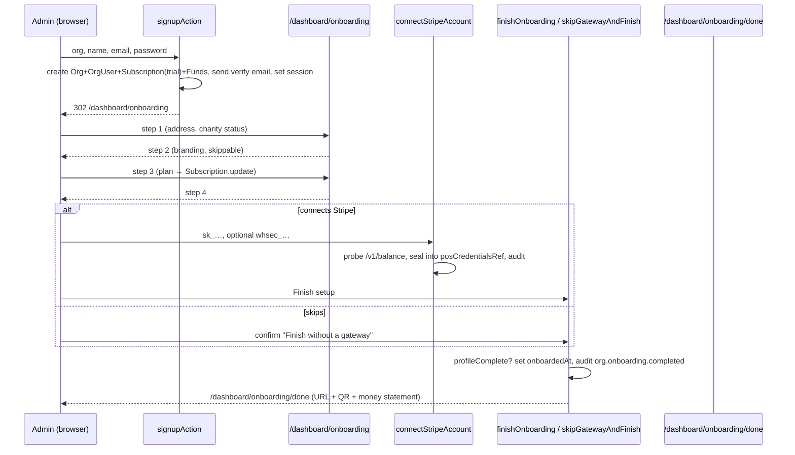

# 12 — Self-serve onboarding (as built)

> Describes what the code does today. Every path below exists; if you change the
> flow, change this file in the same commit. Last verified against `734d305`.

## Why this doc exists

The earlier docs (01 §4.1, 05 §C6, 07 §6) framed onboarding as an open question —
"manual (platform admin creates) vs self-serve". It is decided and shipped:
**self-serve, org-side, four steps, and `onboardedAt` is only set once the charity
can receive money or has explicitly chosen to defer that.**

The reason the fourth step exists is the failure it closes: before it, an org was
marked onboarded the moment a plan was picked, with no mention of a payment
gateway. Its giving page went live running on KindPath's platform account, and
every donation settled somewhere other than the charity's bank.

## 0. Signup → the wizard

`src/app/(auth)/signup/page.tsx` → `signupAction` in `src/app/(auth)/actions.ts`.

| Step | What happens | Where |
|---|---|---|
| Rate limit | 5 signups / minute / IP | `rateLimit("signup:{ip}")` |
| Validate | org name ≥2, admin name ≥2, email, password ≥8 | `signupSchema` |
| Uniqueness | the admin email must not already be an `OrgUser` anywhere | `adminDb.orgUser.findFirst` |
| Slug | `slugify(org)`; on collision, suffixed with 4 base-36 chars | `slugify()` |
| Create | **one nested insert**: `Organization` (charityStatus `non_registered`, receiptLocality "Canada") + `OrgUser` (role `org_admin`) + `Subscription` (plan `starter`, monthly, $29, status `trialing`, `trialEndsAt` = now + 14 d) + two `Fund`s (GEN, BLD) | `adminDb.organization.create` |
| Verify email | `sendEmailVerification` — **non-gating**; failure is swallowed (losing the email is recoverable, losing the signup is not) | `src/lib/auth/email-verification.ts` |
| Session | `createSession({ kind: "org", role: "org_admin", … })` — the admin is signed in **before** verifying | `src/lib/auth/session.ts` |
| Redirect | `/dashboard/onboarding` — the only code path that enters the wizard | |

`onboardedAt` is **not** set at signup. Until it is, the dashboard shows *"Finish
setting up {org}"* (`src/app/(dashboard)/dashboard/page.tsx`). Nothing in
`src/middleware.ts` forces the wizard; it is banner-driven and the sidebar has no
entry for it.

## 1. The wizard

Single route, query-param stepped: `src/app/(dashboard)/dashboard/onboarding/page.tsx`
(`?step=1…4`), actions in `…/onboarding/actions.ts`, forms in
`src/components/onboarding/steps.tsx`. `requireOrgAdmin` throughout — staff
cannot run it. Inherits the dashboard shell and the `surface-app` token scope.

### Step order is enforced

`?step=2|3|4` redirects to `?step=1` until the address from step 1 is saved
(`profileComplete()` in `src/lib/onboarding.ts`). The finish action re-checks the
same predicate server-side — the redirect is UX, the action check is the
guarantee. Before this, `?step=3` was deep-linkable and could complete setup
with a null address, which breaks every official receipt (address is a mandatory
field, `docs/02_COMPLIANCE.md` §1.1) and mis-taxes invoices
(`src/lib/subscriptions.ts` derives GST/HST from `province`).

### Step 1 — Organization & receipts (`saveOrgProfile`)

| Field | Rule | Stored as |
|---|---|---|
| `charityStatus` | `registered` / `non_registered` | as is |
| `craRegistrationNumber` | required when registered; `^\d{9}RR\d{4}$` after stripping spaces | **normalized** `123456789RR0001` (was validated normalized but written raw) |
| `authorizedSignatory` | optional ≤120 | as is |
| `addressLine1` | ≥2 | as is |
| `city` | ≥1 | as is |
| `province` | one of `PROVINCES` codes in `src/lib/tax.ts` (a `<select>`, no longer free text) | code, e.g. `ON` |
| `postalCode` | `A1A 1A1` with or without the space | upper-cased, space inserted |
| `receiptLocality` | derived | `"{city}, {province}"` |

Validation errors return `{ error, fields: { [name]: message } }` so the `Field`
component marks the input (`aria-invalid` + `aria-describedby`).

### Step 2 — Branding (`saveBranding`, skippable)

`primaryColor` (6-hex, `#` added if missing), `logoUrl` (https URL ≤500),
`receiptMessage` (≤300). Empty values write `null`. "Skip for now" is a plain link
to step 3 — branding is genuinely optional. Default swatch is `BRAND_HEX`
(`src/lib/brand.ts`).

### Step 3 — Plan (`choosePlan`)

Updates the existing `Subscription` row (`plan`, `cycle`, `priceCad =
planPrice()` from `src/lib/plans.ts`). **No invoice is created here** — invoicing
is the daily cron (`src/lib/subscriptions.ts` `issueInvoiceForOrg`, idempotent
per month, driven by `/api/cron/billing`). Redirects to step 4. It used to set
`onboardedAt`; it no longer does.

### Step 4 — Get paid (`GatewayStep`)

Renders **the same `GatewayForm`** as Settings → Payments
(`src/components/dashboard/gateway-form.tsx`, actions `connectStripeAccount` /
`disconnectGateway` in `src/app/(dashboard)/dashboard/actions.ts`; see
`docs/13_PAYMENT_GATEWAYS.md` for what connecting does). Below it:

- **Finish setup** — `finishOnboarding`. Disabled until a gateway is connected
  and readable. Sets `onboardedAt`, audits, redirects to the done screen.
- **Skip for now** — `skipGatewayAndFinish`, behind a confirm dialog whose text
  says plainly that donations will not reach the charity's bank until Stripe is
  connected. Also sets `onboardedAt`. Returns `{ ok }` rather than redirecting,
  because `ActionButton` treats a thrown redirect as a failure; the client
  navigates on `ok`.

Both paths write one audit row:
`org.onboarding.completed` with `after: { gatewayConnected, gatewayProvider }`.
That row is the answer to the support question "why didn't our donations arrive".

### Done — `/dashboard/onboarding/done`

`src/app/(dashboard)/dashboard/onboarding/done/page.tsx`. Reachable whenever
`onboardedAt` is set (the wizard redirects finished orgs here, so a charity can
come back for the QR without re-running setup). Shows:

- the giving URL (`givingPageUrl(slug)`) with copy + open, and the QR
  (`givingPageQr`, both in `src/lib/qr.ts` — one generator so the giving page and
  this screen produce the same image);
- **an honest money statement**: Stripe test mode → "use 4242…, no real money
  moves"; live → "a real card will be charged; refund from Stripe"; no gateway →
  the warning block with a Connect Stripe button;
- "Go to dashboard".

## 2. What the dashboard says afterwards

`src/app/(dashboard)/dashboard/page.tsx` has **two** independent banners:

| State | Banner | Link |
|---|---|---|
| `onboardedAt` null | brand-tinted *"Finish setting up {org}"* | `/dashboard/onboarding` |
| `onboardedAt` set, no readable gateway | warning *"You can't receive donations yet"* (or *"Your payment gateway can't be read"* when credentials exist but cannot be decrypted) | `/dashboard/settings#payments` |

"Set up" and "can receive money" are different facts and are shown as such.

## 3. Sequence

## 4. Things deliberately NOT done

- **Email verification does not gate anything.** Refusing access to accounts that
  signed up before verification existed would lock out real customers. It is
  recorded (`OrgUser.emailVerifiedAt`) for later use.
- **No back-navigation between steps.** Every step is re-enterable by URL once step
  1 is saved, and everything is editable in Settings afterwards.
- **No WeVend step.** The WeVend adapter exists but is blocked on a merchant ID
  (`context.md`); the gateway step is Stripe-only and says so.

## 5. Tests and gates

- `src/lib/auth/login-code.test.ts` etc. are unaffected; there is no unit test for
  the wizard itself (server actions + pages). The behaviour was verified in the
  browser on `ad1d61b`: deep-link bounce, BN/postal normalization (`123456789RR0001`,
  `K1A 0B1` stored), skip path → done → dashboard warning, connected path → done
  with test-card hint, 375 px with no horizontal overflow.
- `python3 scripts/audit.py > AUDIT.md` — the onboarding row lists `skipGatewayAndFinish`
  and the new `/dashboard/onboarding/done` route; any other diff is a regression.

## See also

`docs/13_PAYMENT_GATEWAYS.md` (what step 4 stores and how charges route),
`docs/help/GETTING_STARTED.md` (the same flow from the charity's side),
`docs/05_SCREEN_FLOWS.md` §C6 (pointer).
